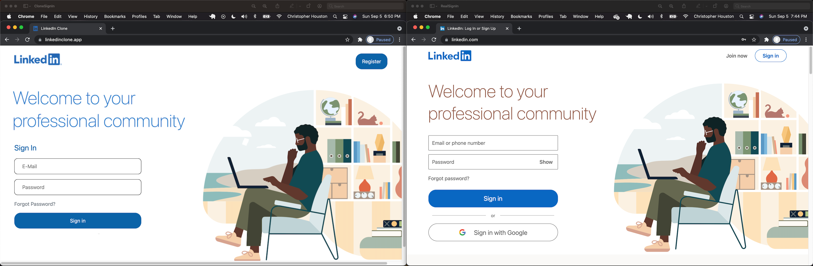
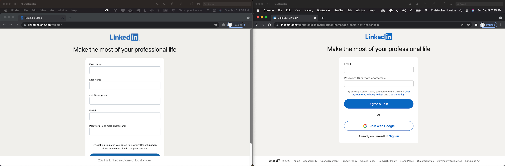
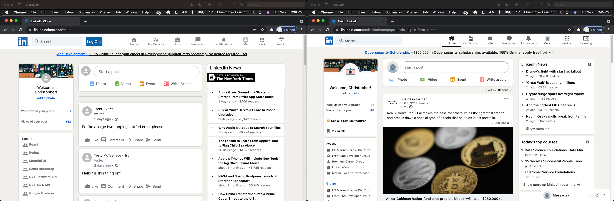

# LinkedIn Clone    

Solo Desktop Website Mockup w/ React

## LIVE WEBSITE BACK UP!  Modified LinkedIn logos to avoid copyright { https://linkedinclone.app }

** In all the following images, my work is first, followed by the actual webpage on the right.**
 

** The LIVE VERSION of this project was taken down by Netlify due to copyright claim from LinkedIn. **

## Sign-In Page
The Home "/" React route is the sign-in page, where the user is prompted to use their e-mail and password to sign in.
If the user isn't registered, they can click the register button and be taken to the next React route to sign up.
 
 

Authentication with E-mail and Password by Google Firebase Authentication
 
 

## Register Page
If the user isn't registered, they can click the register button and be taken to the next React route "/register" to sign up.  Here, the users info is taken so it can be stored in state using the useState hook, and then sent as a 'user' document to Google Cloud Firebase Firestore Database.
 
 

 
 

## Main Page

After the user submits their info, they are notified of successful registration and redirected to the home page where they can use their credentials to log in.
Upon logging in, they are redirected to the third React route, the "/main" page.  Here, their previously entered information is used to populate the fields of their welcome, the 'Start a post' modal pop-up, and the posts they make on the main feed.  Their user information is stored in state using Redux, and as database collection in Google Firebase Firestore Database.
 
 

 
 
On this main page, the technologies used for the project are in the 'Recent' section of the left sidebar.   All the visible icons are sourced from Material UI.  
 
The right widget sidebar contains a New York Times API fetch that gathers the latest headlines in software and displays them using React Bootstrap in a similar fashion to the 'LinkedIn News' section, visible on the real page on the right-hand side of the screen.  Another API fetch  (not visible in screenshot) displays the latest 'Tech' articles down the left-hand sidebar.  These articles are also stored in state using Redux.  
 
Upon clicking 'Start a Post' at the top of the middle feed, a modal appears.  The user can type a message in the text field of the modal which appears instantly at the top of the feed.  Posts are stored as a database collection in Google Firebase Firestore Database.
 

# Languages & Tech
<pre>
React
Redux
Material UI
Google Firebase
JavaScript 
HTML
CSS
2 REST APIs
npm
VSCode
</pre>

